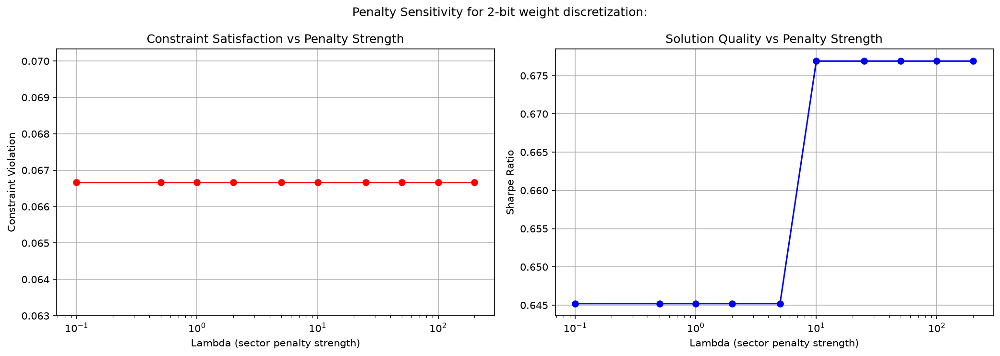
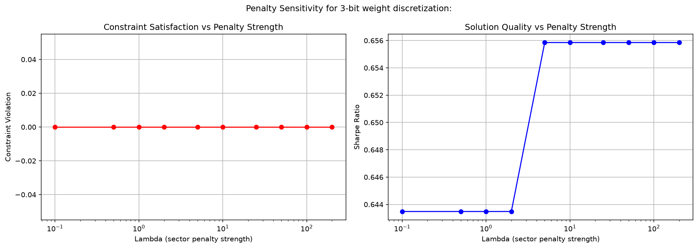

# Quantum-Classical Portfolio Optimization

A research extension of classical mean-variance portfolio optimization into a QUBO/quantum framework, benchmarking QAOA against classical and heuristic solvers with a focus on how portfolio constraints are coded into the optimization objective. Thisproject asks the question of if sector diversification constraints are encoded directly into QUBO's penalty structure (upstream rather than filtered downstream) how does it affect solution quality, constraint satisfaction, and discretization behaviour?

Built as a 4 week extension of a classical portfolio optimization project.

## Overview
This project reformulates the Markowitz portfolio optimization problem (see the 'classical portfolio optimization engine' repo) as a QUBO problem solved via QAOA. Continuous asset weights are discretized through a binary fixed-point encoding, and constraints, including a sector diversification cap, are encoded as penalty terms within the QUBO objective (designed as an 'upstream' penalty).
Three solution methods are implemented and benchmarked against each other on identical problem instances: brute-force serach, classical simulated annealing, and QAOA which is run on PennyLane's quantum simulator. A constrained continuous Markowitz solver is also included as a non-discretized point of reference.
Tested across 3 different qubit instances (N=6,...,10).

## Results

*Sector cap constraint violation and resulting Sharpe ratio as sector penalty strength increases, at 2-bit vs 3-bit weight discretization.*

## Key Findings (Based on N=9)

**1. Simulated annealing (SA) methods matched exact brute force optimum exactly** on the 3-asset, 9 qubit isntance (energy=-6.5297 for both methods, identical portfolio weights: AAPL: 14.29% MSFT: 42.86% GS: 42.86%) despite brute force checking all 512 combinations in 0.002 sec vs SA's 20 secs across 1000 reads. This confirms that SA reliably finds the true optimum at this problem scale and provides a validated heuristic baseline for comparison against QAOA.

**2. Coarse binary discretization produces step-function constraint behaviour** and not a smooth tradeoff. With 2-bit weight encoding the sector-cap constraint violation was fixed at exactly 0.0667 across all lambda from 0.1-200, and since the discretization grid had no achievable point close to the 0.6 cap there were only 2 feasible allocation levels: one far under, and one that violates, and no value of lambda in that range was large enough to force the solver off the high-return violating option.

**3. Increasing to 3-bits eliminated the violation fully (0.00 across all lambdas tested) but revealed another effect** that the symmetric squared penalty term still reshapes the solution even at zero violation. Because lambda*(sum(w_i) - cap)^2 penalizesdistance from the cap in both directions instead of just upstream, higher lambda pulled the solver toward the discretized point closest to the cap even once the point was already compliant which shifted the Sharpe from 0.6435 to 0.6559 at lambda>=5 even with no change in violation. 

**4. QAOA's raw expectation value wasn't anything exceptional, but the sampled measurments concentrated near the true optimum.** After optimizing the circuit parameters, sampling 1000 times produced top-5 most frequent bitstrings with energies -5.6239, -6.4664, -6.4911, -5.7354, -6.2766 against a true optimum of -6.5297, despite the optimizer's expectation-value not looking so similar to the true optimum. This reveals a nuance in interpreting QAOA results as there is a distinct difference in interpreting the optimized expectation value alone versus individual sampled outcomes.

**5. Experienced a bottleneck when it came to the 10 qubits instance.** With shallow p=1,2 circuits and a single Trotter step, QAOA energies at 10 qubits landed in extreme positives (as high as +11) which is far from the optimum of -6.45, while brute-force and SA both solved the same instance with no difficulties.

## Mathematical and Quantum Computing Framework
**Binary encoding:** for each continuous asst weight w_i is represented via binary expansion across n_bits binary variables.
w_i = (1 / (2^n_bits - 1)) * sum_k( 2^k * x_{i,k} )

**QUBO objective:** portfolio objective x^TQx combines the following into a single matrix Q:
1- Return term(linear on the diagonal): -sum_i( mu_i * w_i ) maximizes the expected return by minimizing its negative
2- Risk term (quadratic): lambda_risk * w^TSigmaw which is the portfolio variance expanded to binary
3- Budget constraint (penalty): lambda_budget * (sum_i(w_i) - 1)^2 so the weights sum to 1
4- Sector cap (upstream penalty): lambda_sector * (sum_{i in sector}(w_i) - cap)^2 per sector

**QUBO to Ising Hamiltonian:** For quantum circuit binary variables are mapped to spin variables through x_i = (1 - Z_i)/2 which converts QUBO matrix to Ising Hamiltonian H=offset + sum(h_i * Z_i) + sum(J_ij * Z_i * Z_j) that QAOA operates on

**QAOA Circuit:** p-layer QAOA circuit alternates a cost and a mixer unitary starting from an equal superposition for all bitstrings. Circuit parameters gamma and beta are optimized using COBYLA to minimize the expectation value of H.

## Scope

Every instance tested here (6 through 10) is showing that brute force solves even the largest instance tested in a couple of milliseconds. At this scale the quantum method isn't plausibly outperforming classical computing, since the classical is not being challenged. The value of this work's methodology is studying how upstream constraint encoding behaves with QUBO at a scale that is small enough to validate each result against the exact brute-force counterpart. This project as well is not being benchmarked against a MIQP solver which would have probably outperformed both SA and QAOA at this problem's scale. I will be extending this project by adding a MIQP solver as well as extending instances towards larger asset universes (correcting the N=10 notebook is scoped as the first next step before this). 
Initially all the quantum results reported from PennyLane's noiseless simulator. A noise sensitivity check using depolarizing noise channel is added to Week 4 to show to what extent the results are expected to degrade under realistic hardware noise.

## References and Libraries

- Lucas, A. (2014) *Ising formulations of many NP problems*
- Glover, Kochenberger and Du (2022)*Quantum Bridge Analytics I: A Tutorial on Formulating and Using QUBO Models*
- IBM Quantum Platform: Basics of quantum information course
- Libraries: numpy pandas matplotlib yfinance scipy dimod pennylane

